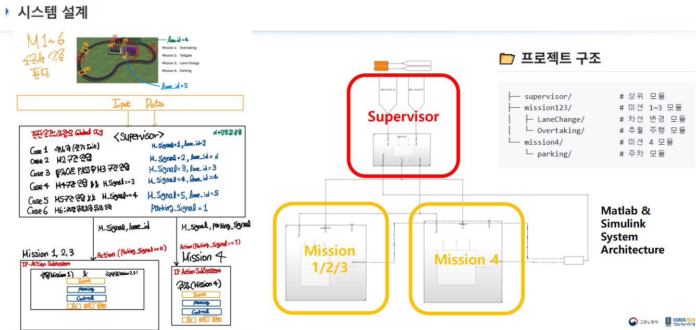
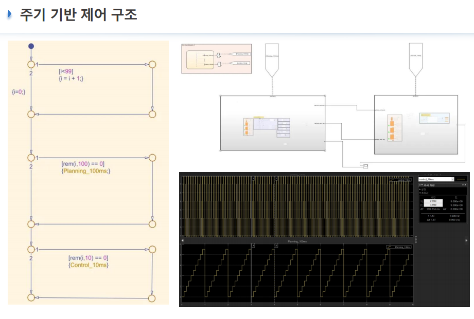
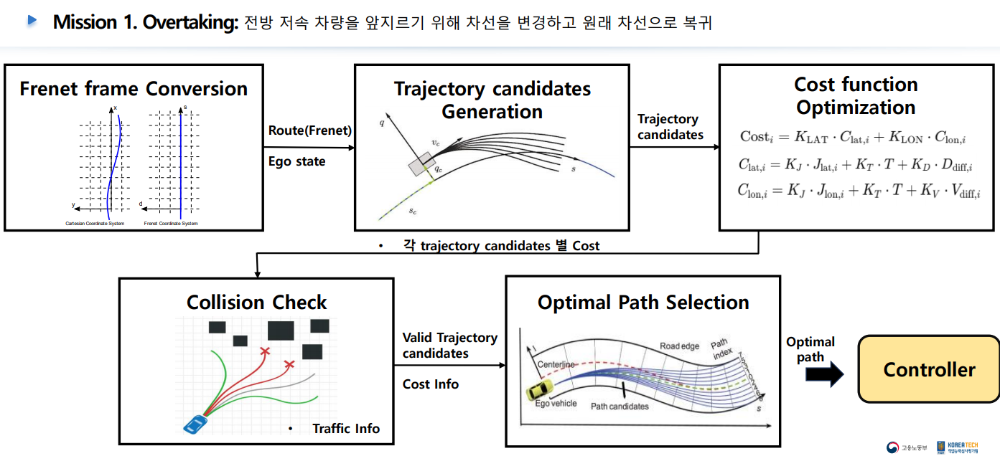
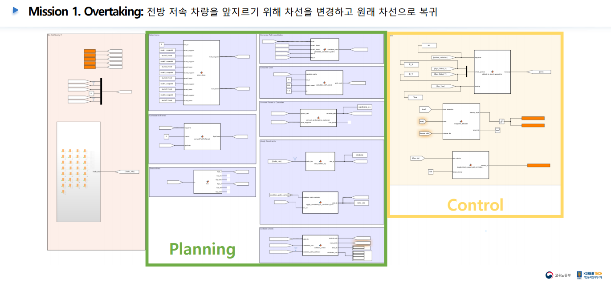
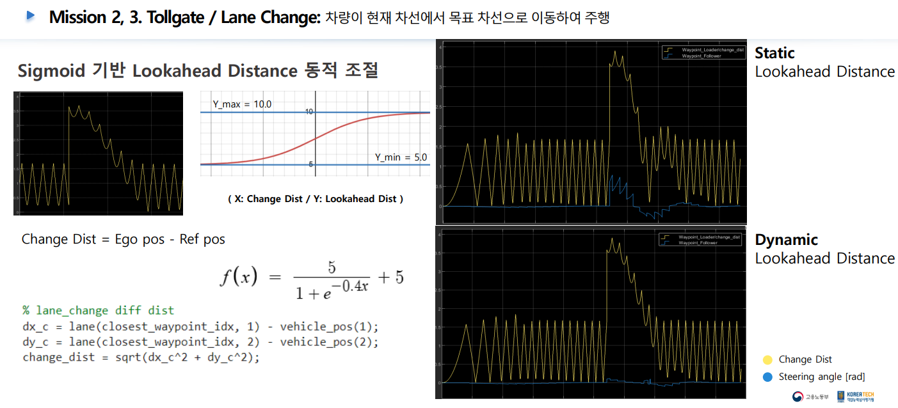
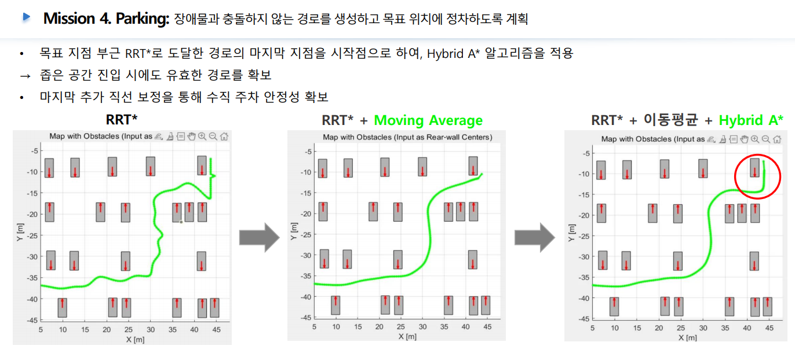
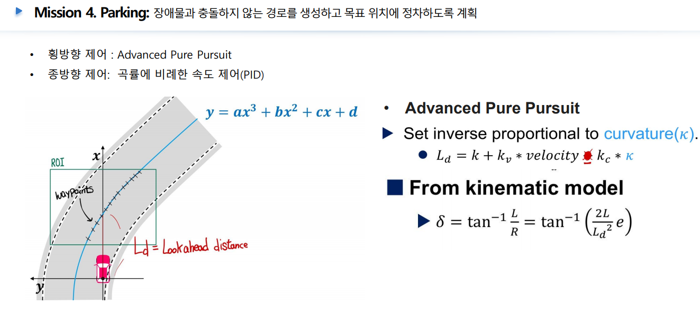

# 🚗 HL Mando & HL KLEMOVE Intelligent Vehicle School 

> ADAS Motion Planning & Control 프로젝트 - Team 오토방구

## 📌 프로젝트 소개

**자율주행차 연구 및 실차 적용을 위한 ADAS Motion Planning & Control 알고리즘 개발 프로젝트입니다.**  
MATLAB & Simulink 기반으로, 실제 도로 환경을 반영한 시나리오별 미션(추월, 톨게이트, 차선 변경, 주차)을 구현하고 시뮬레이션을 통해 성능을 검증합니다.

## 🚦 주요 미션

- **Mission 1. Overtaking:**  
  전방 저속 차량을 안전하게 추월 후 원래 차선 복귀
- **Mission 2. Tollgate:**  
  톨게이트 상황에서의 경로 생성 및 통과
- **Mission 3. Lane Change:**  
  목표 차선으로의 안전한 차선 변경
- **Mission 4. Parking:**  
  장애물 회피 및 주차 경로 생성, 목표 위치 정차

## 🛠️ 사용 기술 및 개발 환경

- **개발환경:** MATLAB 2024a, Simulink
- **시뮬레이션:** CarMaker 14.0.1
- **형상관리:** GitHub

## 🧑‍💻 팀 구성 및 역할

### 1팀 (주차, 차선 변경)

| 이름     | 역할   | 담당 업무                                   |
|:-------:|:------:|:-------------------------------------------|
| 최종환   | 팀장/설계   | 시스템 아키텍처 설계 / 시스템 통합 / 시스템 검증  / 주차 제어 |
| 최수빈   | 개발/검증   | 자율주행 Lane Change 및 차량 제어 / 시스템 검증 |
| 유형종   | 개발   | 자율주행 주차 path 생성 알고리즘 구현 / Map 생성 및 시뮬레이션 |
| 한대혁   | 개발   | 충돌 감지 및 주차 시스템 구현 / Map 생성 및 시뮬레이션 |

### 2팀 (추월)

| 이름     | 역할   | 담당 업무                                                      |
|:-------:|:------:|:------------------------------------------------------------|
| 김호진   | PM   | 데이터 정제 및 정규화 / 형상 관리 / Issue 관리 및 피드백|
| 송형라   | 검증   | Frenet to Global, 시스템 검증, PPT 제작      |
| 이지민   | 개발   | Candidate paths 생성, 최적화 및 Parameter Tuning / Data Visualization |
| 조수빈   | 개발   | Cost 설계/파라미터, Candidate Paths 생성, Trajectory planning Algorithm 설계 및 개발 |
| 조희연   | 개발   | Global to Frenet 변환 / Candidate paths 생성  / PPT 제작|
| 천세영   | 설계   | 시스템 아키텍처 설계 / 경로 제약 조건 설계 / 유효 Candidate selection / Parameter Tuning|


## 📂 프로젝트 구조

```
├── supervisor/           # 상위 모듈
├── mission123/           # 미션 1~3 모듈
│   ├─ LaneChange/        # 차선 변경 모듈
│   └─ Overtaking/        # 추월 주행 모듈
└── mission4/             # 미션 4 모듈
    └─ parking/           # 주차 모듈
```


## ✨ 주요 기능 및 구현 내용

- **경로 생성:** Frenet/Global 변환 기반 경로 후보 생성 및 최적 경로 선택
- **비용 함수 최적화:** 다양한 cost function 적용 및 파라미터 튜닝
- **시뮬레이션:** CarMaker 연동, 미션별 시나리오 검증
- **주차 알고리즘:** RRT*, Hybrid A* 등 적용


## 🖼️ 프로젝트 내용
















## 💡 프로젝트 활용 및 기대 효과

- 자율주행차 연구 및 실차 개발 적용
- 시뮬레이션 기반 신뢰성 검증
- 운전자 스트레스 감소 및 안전성 향상


## 📝 팀 회고 & 개선점

- **잘한 점:** 실제 환경을 반영한 시나리오별 미션 구현, 팀원 간 협업 및 코드 통합, 시뮬레이션 기반 검증
- **아쉬운 점:** 일부 미션에서의 세부 성능 한계, 시간 부족으로 인한 최적화 미흡
- **향후 개선:** 모델 정확도 향상, 추가 미션/실차 적용, 코드 리팩토링 및 문서화

## 노션 페이지 
https://www.notion.so/1f189ed96aa1806495e9f2617c1113d8?v=1f189ed96aa18047bd58000c21cd463f

## 시연 영상
https://youtu.be/falxSdTmnzs